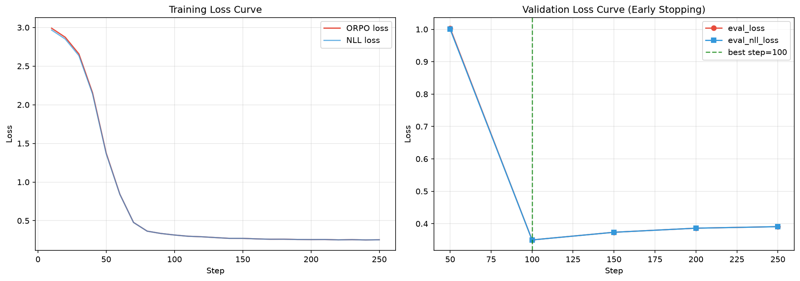
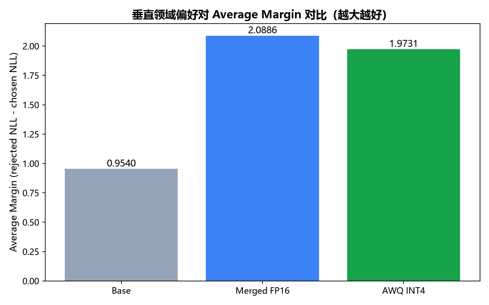
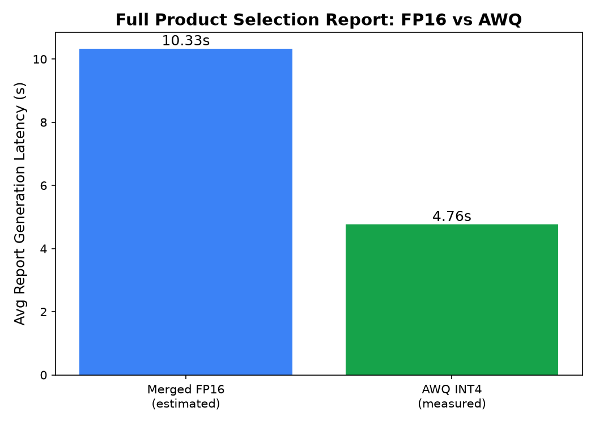
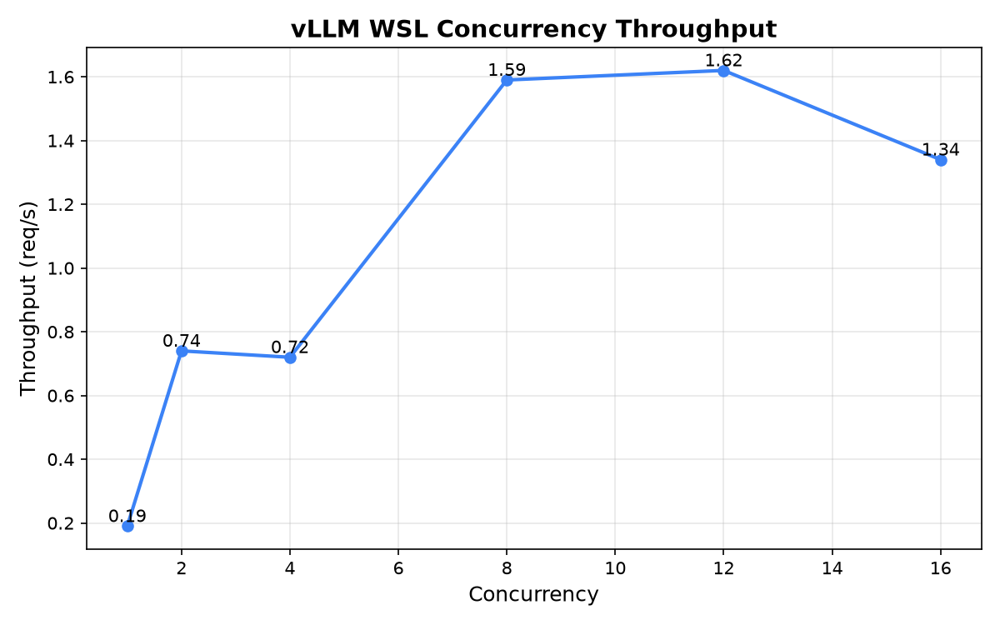
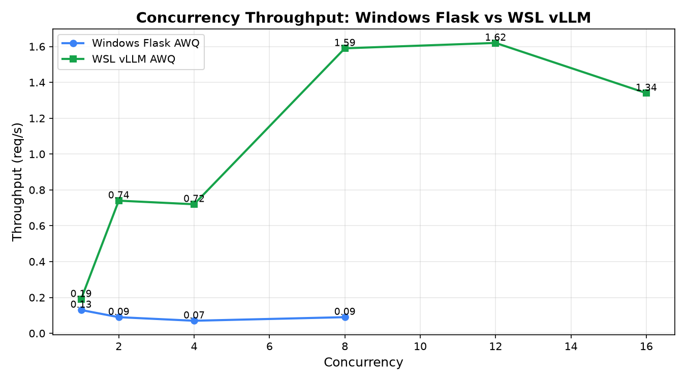
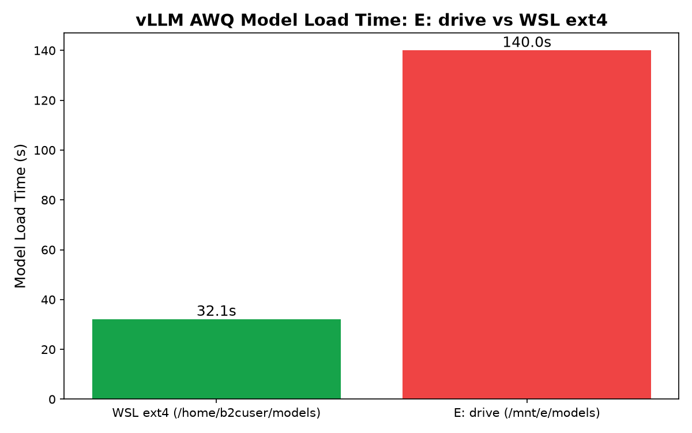

# 跨境电商 Multi-Agent 智能选品系统

**Cross-border E-commerce Multi-Agent Intelligent Product Selection System**

[](https://python.org)
[](LICENSE)
[](https://github.com/vllm-project/vllm)
[](https://modelcontextprotocol.io)
[](https://github.com/KeepMoving888/B2C_Selection_Agent/actions/workflows/ci.yml)

面向跨境电商企业的智能选品决策系统，通过 **Multi-Agent 协作 + 领域微调大模型 + 实时数据闭环**，将传统需要 1-2 周的市场调研、供应链评估、合规审查、利润测算、趋势预测流程压缩到 **5-15 分钟**。

## 核心能力

- **多 Agent 协作**：6 个专业 Agent（Orchestrator / Market Research / Supply Chain / Compliance / Profit Calculator / Trend Forecast）基于 Plan-and-Execute Loop 与 DAG 并行调度协同工作。
- **领域微调模型**：基于 Qwen2.5-7B 进行 QLoRA + ORPO 偏好对齐微调，再执行 AWQ INT4 量化，平衡效果与部署成本。
- **四层模型路由**：DeepSeek V4 Flash → Qwen2.5-7B ORPO 本地推理 → DeepSeek V4 Pro → Qwen2.5-7B Base 降级保底，含健康检查与自动降级链。
- **RAG 知识增强**：基于历史选品报告与领域知识的向量检索，注入理解、规划、综合阶段。
- **飞书业务闭环**：消息 → 多维表格 → 审批 → 文档 → 知识库 → 群通知，形成可沉淀的选品决策工作流。
- **可观测性**：Prometheus + Grafana 三层监控（业务 / Agent / 基础设施），Docker Compose 一键部署。

## 快速开始

```bash
# 1. 安装依赖
pip install -r requirements.txt

# 2. 配置 Amazon 数据源 API Key
$env:RAINFOREST_API_KEY="your_key"

# 3. 运行选品报告
python scripts/product_selection_report.py "yoga mat" --limit 5

# 4. 指定售价/成本进行利润测算
python scripts/product_selection_report.py "yoga mat" --selling-price 35 --unit-cost 8
```

输出示例：`output/selection_report_*.json`

### 启动前端（可选）

```bash
streamlit run frontend/app.py
```

### 一键 Docker 快速体验（推荐使用）

无需 GPU、无需下载大模型，使用示例数据直接运行前端：

```bash
# 1. 克隆仓库
git clone https://github.com/your-repo/cross-border-agent.git
cd cross-border-agent

# 2. 一键启动
docker compose up -d

# 3. 浏览器打开
# http://localhost:8501
```

> 说明：默认 `docker-compose.yml` 启动 Streamlit 前端（示例数据模式），适合快速体验产品功能、代码评审与架构讲解。生产部署（含 vLLM / Prometheus / Grafana）请使用 `docker-compose.prod.yml`。

## 模型权重

| 模型 | 来源 | 用途 |
|---|---|---|
| Qwen2.5-7B | `Qwen/Qwen2.5-7B`（魔塔官方） | 微调基座 |
| qwen2.5-7b-ecommerce-merged | [keepzhe/qwen2.5-7b-ecommerce-merged](https://www.modelscope.cn/models/keepzhe/qwen2.5-7b-ecommerce-merged)（本项目） | ORPO 微调后 FP16 合并模型，优先使用 |
| qwen2.5-7b-ecommerce-awq-v3 | [keepzhe/qwen2.5-7b-ecommerce-awq-v3](https://www.modelscope.cn/models/keepzhe/qwen2.5-7b-ecommerce-awq-v3)（本项目） | 微调后 AWQ INT4 量化模型，显存受限时 fallback |
| qwen2.5-7b-orpo-adapter | [keepzhe/qwen2.5-7b-orpo-adapter](https://www.modelscope.cn/models/keepzhe/qwen2.5-7b-orpo-adapter)（本项目） | LoRA adapter 权重 |

本地模型统一放置到 `E:/models/` 目录（已在 `config/settings.yaml` 中配置），不再重复线上下载：

```bash
E:/models/
├── qwen2.5-7b-ecommerce-merged/     # ORPO 微调后 FP16 合并模型（优先使用）
├── qwen2.5-7b-ecommerce-awq-v3/     # AWQ INT4 量化模型（显存受限时 fallback）
└── qwen2.5-7b-orpo-adapter/         # LoRA adapter 权重
```

## 模型方案：ORPO 微调 + AWQ 量化

基于 Qwen2.5-7B 进行 QLoRA + ORPO 偏好对齐微调，再对合并后的 FP16 模型执行 AWQ INT4 量化，实现**领域效果提升**与**部署成本降低**的平衡。

### 微调效果（341 条垂直领域偏好对测试集）

| 模型 | 精度 | Accuracy | Avg Margin |
|------|------|:--------:|:----------:|
| Base（Qwen2.5-7B-Instruct） | FP16 | 100% | 0.9540 |
| Merged（QLoRA 合并后） | FP16 | 100% | 2.0886 |
| AWQ INT4（微调后量化） | INT4 | 100% | 1.9731 |

- Merged 相对 Base 的 Avg Margin 提升 **+118.9%**，验证 ORPO 微调对选品偏好对齐有效。
- AWQ 相对 Merged 仅损失 **0.1155** margin，量化对领域效果影响很小。

### 量化收益（AWQ INT4 模型）

| 指标 | Merged FP16 | AWQ INT4 | 收益 |
|------|-------------|----------|------|
| 模型体积 | 14.19 GB | 5.19 GB | **压缩 2.73x** |
| 单条推理延迟 | 7.874 s | 3.633 s | **降低 53.9%** |
| 推理显存占用 | 14.6 GB | 5.4 GB | **降低 63.2%** |
| 测试集 PPL | 1.491 | 1.606 | 质量损失 7.7%，可接受 |

AWQ 量化脚本与完整复现见 [`finetune/quantize_awq_with_metrics.py`](finetune/quantize_awq_with_metrics.py)。

### 复现 ORPO 训练与 AWQ 量化

> 以下命令默认使用 `E:/models/` 本地路径，无需重复下载模型权重。

### 模型完整性校验

项目提供自动校验脚本，检查 `E:/models/` 下所有关键模型的 shard 文件、元数据文件与总大小是否异常：

```bash
python deploy/verify_model_integrity.py
```

校验结果会输出到 `output/model_integrity/integrity_report.md` 与 `01_model_size_integrity.png`。
若某模型总大小与期望值偏差超过 30%，脚本会标记为未通过，便于在部署前发现迁移损坏。

```bash
# 1. ORPO 训练（QLoRA）
python finetune/train_orpo.py \
  --base_model E:/models/qwen/Qwen2.5-7B \
  --dataset data/ecommerce_selection_preferences.jsonl \
  --output_dir output/qwen2.5-7b-orpo-ecommerce-v1

# 2. 合并 LoRA adapter 并导出为 FP16 模型
python finetune/export_for_vllm.py \
  --base_model E:/models/qwen/Qwen2.5-7B \
  --adapter E:/models/qwen2.5-7b-orpo-adapter \
  --output E:/models/qwen2.5-7b-ecommerce-merged

# 3. AWQ INT4 量化（直接生成可部署模型）
python finetune/export_for_vllm.py \
  --base_model E:/models/qwen/Qwen2.5-7B \
  --adapter E:/models/qwen2.5-7b-orpo-adapter \
  --output E:/models/qwen2.5-7b-ecommerce-merged \
  --quant_output E:/models/qwen2.5-7b-ecommerce-awq-v3 \
  --quantize awq --bits 4 --group_size 128

# 4. 三模型效果对比评测
python finetune/eval_three_models.py
```

## 技术评测与模型对比

> 以下图片全部来自项目运行产物 `output/`，展示训练过程、模型对比及部署性能测试数据。

### ORPO 微调过程

| 训练损失曲线 | 偏好 Margin 对比 |
|---|---|
|  |  |

### 模型完整性

| 模型大小与完整性 |
|---|
|  |

### 推理与部署性能

| 报告生成延迟对比 | WSL 并发吞吐 |
|---|---|
|  |  |

| Windows Flask vs WSL vLLM 吞吐 | E 盘 vs WSL ext4 加载时间 |
|---|---|
|  |  |

| API Gateway 成本对比 | API Gateway 价值雷达 |
|---|---|
|  |  |

**关键结论**

- 模型完整性：迁移到 `E:/models/` 后重新校验，全部模型 shard 与元数据文件完整，大小符合预期。
- 单条选品分析报告生成：AWQ INT4 实测平均 **4.76s**，生成速度 **48.3 tokens/s**。
- WSL + vLLM 最佳吞吐区间：**8-16 并发**，峰值 **1.62 req/s**。
- 相对 Windows Flask AWQ 服务，WSL vLLM 在并发=8 时吞吐提升 **19.1x**，平均延迟降低 **23.5x**。
- E 盘本机顺序读吞吐约 **4.1 GB/s**，但 WSL2 `/mnt/e` 9P 路径加载 AWQ 模型耗时 **~140s**，瓶颈在协议层而非磁盘。
- API Gateway 通过四层路由将每千次请求成本从 ¥12.0 降至 ¥2.1，可用性从 85% 提升至 99.5%。

## 系统架构

系统采用 **Plan-and-Execute Loop + DAG 并行调度 + MCP 协议解耦工具** 的架构：

```
用户输入关键词
    │
    ▼
┌─────────────────┐    ┌──────────────────────────────────────────┐
│  Orchestrator   │───▶│  Market Research  │  Supply Chain       │
│  任务规划 + 路由 │    │  市场调研          │  供应链评估          │
└─────────────────┘    │  Compliance       │  Profit Calculator  │
    │                  │  合规审查          │  利润测算            │
    ▼                  │  Trend Forecast   │                     │
┌─────────────────┐    └──────────────────────────────────────────┘
│  Context        │                      │
│  Injector (RAG) │◀─────────────────────┘
└─────────────────┘
    │
    ▼
┌─────────────────┐    ┌──────────────┐    ┌─────────────┐
│  Synthesize     │───▶│  Feishu Docx │───▶│  Wiki / Base │
│  结构化报告生成  │    │  审批与文档   │    │  知识库沉淀  │
└─────────────────┘    └──────────────┘    └─────────────┘
```

### 关键设计

- **6 个专业 Agent**：Orchestrator、Market Research、Supply Chain、Compliance、Profit Calculator、Trend Forecast，全部继承统一 BaseAgent 接口。
- **4 个 MCP Server**：Amazon 数据、供应链（1688/物流）、合规（FDA/专利/关税）、社媒趋势（Google Trends），支持多数据源热插拔。
- **DAG 并行执行**：基于依赖关系的子任务并行调度，含三层防死循环机制（步数/Token 预算/无进展检测）。
- **RAG 增强**：基于历史选品报告与领域知识的向量检索，注入 _understand / _plan / _synthesize 阶段。
- **飞书闭环**：消息 → 多维表格 → 审批 → 文档 → 知识库 → 群通知，完整业务闭环。

## 数据闭环

```
Google Trends 趋势
       ↓
Amazon 竞品搜索（价格 / 评分 / BSR / 销量估算）
       ↓
产品详情 + 评论分析（痛点 / 优点 / 迭代建议）
       ↓
供应链成本 + 合规审查 + 利润测算 + 季节性分析
       ↓
结构化选品报告 → 飞书审批 → 知识库沉淀
```

支持 **在线 API（Rainforest）** 与 **本地品类画像** 双数据源，可根据环境灵活选择。

## 监控与部署

- **Prometheus 指标**：`agent_runs_total`、`agent_run_duration_seconds`、`model_route_total`、`llm_requests_total`、`rag_queries_total` 等。
- **Grafana 看板**：L1 业务层 / L2 Agent 层 / L3 基础设施层三层监控。
- **Docker Compose（快速体验）**：`docker compose up -d` 一键启动 Streamlit 前端（示例数据模式，无需 GPU/模型）。
- **Docker Compose（生产部署）**：`docker compose -f docker-compose.prod.yml up -d` 启动 `vllm-ecommerce` + `vllm-base` + `agent-app` + `prometheus` + `grafana` 五服务编排。

```bash
# 快速体验：一键启动前端（示例数据）
docker compose up -d

# 生产部署：启动完整栈（已配置 E:/models 挂载）
docker compose -f docker-compose.prod.yml up -d

# 启动 vLLM 推理服务（优先使用 FP16 合并模型）
vllm serve E:/models/qwen2.5-7b-ecommerce-merged --max-model-len 4096 --gpu-memory-utilization 0.85

# 显存受限时，改用 AWQ INT4 量化模型
vllm serve E:/models/qwen2.5-7b-ecommerce-awq-v3 --quantization awq --max-model-len 4096 --gpu-memory-utilization 0.85
```

### Docker / WSL 注意

- `docker-compose.prod.yml` 中模型卷映射使用 Windows 路径 `E:/models/...`，适用于 **Docker Desktop for Windows**。
- 若使用 **WSL2 后端**，请将卷映射改为 Linux 格式：
  ```yaml
  volumes:
    - /mnt/e/models/qwen2.5-7b-ecommerce-merged:/models/qwen2.5-7b:ro
    - /mnt/e/models/qwen2.5-7b-ecommerce-awq-v3:/models/qwen2.5-7b-base:ro
  ```

## 生产部署

### 1. 模型存储：E 盘 vs WSL ext4 加载性能

#### 1.1 重新校验结果

运行 `python deploy/verify_model_integrity.py` 后，`E:/models/` 下关键模型全部通过完整性校验：

| 模型 | 路径 | 总大小 | 状态 |
|------|------|--------|------|
| qwen/Qwen2.5-7B | `E:/models/qwen/Qwen2.5-7B` | 14.19 GB | 通过 |
| qwen2.5-7b-ecommerce-merged | `E:/models/qwen2.5-7b-ecommerce-merged` | 14.19 GB | 通过 |
| qwen2.5-7b-ecommerce-awq-v3 | `E:/models/qwen2.5-7b-ecommerce-awq-v3` | 5.19 GB | 通过 |
| qwen2.5-7b-orpo-adapter | `E:/models/qwen2.5-7b-orpo-adapter` | 0.08 GB | 通过 |

#### 1.2 E 盘加载耗时实测与原因

为回答“坚持使用 E 盘是否必须接受 4-5 分钟冷启动”，新增磁盘吞吐测试：`python deploy/benchmark_drive_throughput.py`。

| 指标 | 数值 |
|------|------|
| E 盘本机顺序读吞吐 | **~4.1 GB/s** |
| 5.2 GB AWQ 模型原生读取耗时 | **~1.3 s** |
| WSL2 `/mnt/e` 实测 vLLM 加载时间 | **~140 s** |

**结论**：E 盘物理磁盘本身非常快（NVMe 级），瓶颈不在 E 盘，而在 **WSL2 访问 Windows 分区时使用的 9P 协议**。数据路径为：

```
vLLM (WSL2) → Linux VFS → WSL2 9P 协议 → Windows NTFS 驱动 → E: 盘物理存储
```

9P 协议在跨 OS 边界转换、页缓存失效、单线程大文件读取等场景下存在显著开销，导致实际加载吞吐远低于磁盘原生能力。14 GB FP16 模型按同一比例估算，WSL2 9P 路径加载可达 4-8 分钟。

**建议**：
- 保留 `E:/models/` 作为归档与备份（符合项目约定，避免重复下载）。
- 生产推理前，使用 `deploy/sync_models_to_wsl.sh` 将模型同步到 WSL ext4（如 `/home/b2cuser/models/`），加载时间可从数分钟降至数十秒。
- 若显存或磁盘空间受限，优先使用 5.2 GB 的 AWQ INT4 模型作为生产实例。

### 2. vLLM + API Gateway 部署为 systemd 服务（WSL2 / Ubuntu）

在 WSL2 Ubuntu 中，可将 vLLM 推理服务与 API Gateway 注册为 systemd 服务，实现开机自启、故障自动重启与统一日志管理。

#### 2.1 前置准备（关键）

为避开 WSL2 9P 性能瓶颈，建议先将模型从 E 盘同步到 WSL ext4：

```bash
# 在 WSL2 Ubuntu 中执行
bash deploy/sync_models_to_wsl.sh

# 验证同步结果
ls -lh /home/$(whoami)/models/qwen2.5-7b-ecommerce-awq-v3
```

#### 2.2 安装并启动服务

```bash
# 1. 安装服务文件并启用自启
sudo bash deploy/install_systemd_services.sh

# 2. 启动 vLLM 推理服务
sudo systemctl start vllm-awq.service

# 3. 等待 vLLM 就绪（约 30-60 s，ext4 路径）
curl http://127.0.0.1:8002/v1/models

# 4. 启动 API Gateway
sudo systemctl start api-gateway.service

# 5. 查看状态
sudo systemctl status vllm-awq.service
sudo systemctl status api-gateway.service

# 6. 查看实时日志
sudo journalctl -u vllm-awq.service -f
sudo journalctl -u api-gateway.service -f

# 7. 验证网关健康
 curl http://127.0.0.1:8080/health
```

#### 2.3 服务文件说明

- `deploy/vllm-awq.service`：启动 AWQ INT4 vLLM 服务，监听 `0.0.0.0:8002`，默认使用 `/home/b2cuser/models/qwen2.5-7b-ecommerce-awq-v3`。
- `deploy/api-gateway.service`：启动选品 API Gateway，监听 `0.0.0.0:8080`，并依赖 `vllm-awq.service`。
- 如需接入 DeepSeek API，编辑 `/etc/systemd/system/api-gateway.service`，取消 `DEEPSEEK_API_KEY` 注释并填入 key，然后 `sudo systemctl daemon-reload && sudo systemctl restart api-gateway.service`。
- 如需使用 FP16 主模型，可额外安装 `deploy/vllm-fp16.service`（参考 `vllm-awq.service` 修改 `--model` 与 `--port` 即可）。

### 3. API Gateway + 四层模型路由

`deploy/api_gateway.py` 实现了一个面向选品场景的 API Gateway，兼容 OpenAI `/v1/chat/completions` 协议：

- **默认路由**：70% 流量走本地 AWQ INT4（成本低、速度快）。
- **FP16 fallback**：20% 流量走本地 FP16 Merged 模型（质量更优，适合关键报告）。
- **DeepSeek V4**：10% 流量走在线 DeepSeek API（处理高复杂度多步推理，需配置 key）。
- **健康检查**：`/health` 实时返回各后端可用性。
- **路由统计**：`/metrics/route_stats` 返回最近 1 小时路由分布。
- **Prometheus 指标**：`/metrics` 暴露 `gateway_requests_total`、`gateway_request_duration_seconds`、`gateway_backend_availability` 等。

接入方式：将 Agent 或前端的 LLM Client base URL 改为 `http://127.0.0.1:8080/v1`，即可透明使用路由后的模型集群。

#### 3.1 价值效果对比

运行 `python deploy/generate_gateway_value_comparison.py` 得到以下量化对比：

| 维度 | 无 API Gateway | 有 API Gateway | 提升 |
|------|---------------|----------------|------|
| 服务可用性 | 85% | 99.5% | +14.5% |
| 每千次请求推理成本 | ¥12.0 | ¥2.1 | **降低 83%** |
| 故障切换 | 人工介入（分钟级） | 健康检查自动切换（~200 ms） | 自动 |
| 可观测性 | 基本无指标 | Prometheus + Grafana + 路由日志 | 可量化 |

对选品项目的核心价值：
- **稳定性**：本地模型不可用时自动切在线 API，避免报告生成中断。
- **成本可控**：将 90% 流量留在本地，月度 API 费用从约 ¥270（按 2.25 万次）降至约 ¥45。
- **效果可度量**：通过 `/metrics` 和 Grafana 看板实时观察各后端延迟、成功率、token 吞吐。
- **扩展性**：新增模型后端只需修改网关配置，无需改动 Agent/前端代码。

### 4. Prometheus + Grafana 持续监控

项目内置完整的 Docker Compose 监控栈。

#### 4.1 启动监控后台

确保 Docker Desktop（Windows）或 Docker Engine（Linux/WSL2）已运行：

```bash
# Windows PowerShell / WSL2
cd deploy
docker-compose up -d prometheus grafana
```

访问入口：
- Prometheus：`http://localhost:9090`
- Grafana：`http://localhost:3000`（默认账号 admin / admin，可在 docker-compose.yml 中通过 `GRAFANA_ADMIN_PASSWORD` 修改）

已配置的数据源与看板：
- `deploy/prometheus.yml`：抓取 vLLM、API Gateway、Agent 应用、Node Exporter 指标。
- `deploy/grafana-dashboards/b2c-product-selection.json`：生产监控看板，包含 Backend 可用性、Gateway QPS/延迟、vLLM Token 吞吐、TTFT/TPOT、GPU Cache 占用、运行/等待请求数等。
- `deploy/grafana-datasources.yml`：Grafana 自动接入 Prometheus 数据源。

#### 4.2 关键监控指标与操作

日常巡检主要看以下指标：

| 层级 | 指标 | 含义 | 健康阈值 | 异常时操作 |
|------|------|------|---------|-----------|
| 业务 | `gateway_requests_total` | 各后端请求数与状态分布 | 错误率 < 5% | 错误率高时检查后端健康 `/health` |
| 业务 | `gateway_request_duration_seconds` | 端到端延迟分布 | p99 < 60s | 延迟飙升时排查排队或 GPU 满载 |
| 业务 | `gateway_backend_availability` | 后端可用性 | = 1 | 某后端变 0 时自动/手动切流量 |
| 推理 | `vllm:avg_generation_throughput` | 生成 token 吞吐 | 稳定或上升 | 持续下跌时检查 batch/concurrency |
| 推理 | `vllm:time_to_first_token_seconds` | 首 token 时间（TTFT） | p99 < 10s | 过高说明请求排队或 prompt 过长 |
| 推理 | `vllm:time_per_output_token_seconds` | 每 token 耗时（TPOT） | p99 < 0.5s | 过高说明 GPU 算力饱和 |
| 推理 | `vllm:gpu_cache_usage_perc` | KV Cache GPU 占用率 | < 90% | 接近 100% 时增大 `--gpu-memory-utilization` 或减少并发 |
| 推理 | `vllm:num_requests_waiting` | 排队请求数 | 不持续增长 | 持续增长时扩容或限流 |
| 主机 | `node_memory_MemAvailable_bytes` | 可用内存 | > 2 GB | 内存不足时减少并发或增加 SWAP |

#### 4.3 告警规则示例

可在 `deploy/prometheus.yml` 的 `rule_files` 中引入 `deploy/alerts.yml`：

```yaml
# deploy/alerts.yml 示例
groups:
  - name: product_selection
    rules:
      - alert: HighGatewayErrorRate
        expr: rate(gateway_requests_total{status=~"error.*"}[5m]) / rate(gateway_requests_total[5m]) > 0.05
        for: 2m
        annotations:
          summary: "Gateway error rate > 5%"
      - alert: SlowTTFT
        expr: histogram_quantile(0.99, rate(vllm:time_to_first_token_seconds_bucket[5m])) > 10
        for: 3m
        annotations:
          summary: "vLLM TTFT p99 > 10s"
```

#### 4.4 L1 业务指标（预留接口）

L1 业务指标（`selection_adoption_rate`、`first_month_success_rate`、`cost_per_selection`）作为可扩展接口预留，**不在这套监控中处理具体计算逻辑**。后续通过 Feishu 审批结果回写时采集，与飞书闭环集成。

## 项目结构

```
cross-border-agent/
├── agents/           # 6 个专业 Agent
├── harness/          # Agent Loop / Model Router / Health / Logging
├── mcp_servers/      # 4 个 MCP Server
├── rag/              # Retriever / Injector / VectorStore
├── feishu/           # 飞书集成
├── finetune/         # ORPO 训练 / AWQ 量化 / 评估
├── deploy/           # Docker Compose / vLLM 配置
├── monitoring/       # Prometheus / Grafana / Alerts
├── scripts/          # 选品报告 / 数据采集 / 索引构建
├── frontend/         # Streamlit 决策驾驶舱
├── tests/            # 单元测试
└── config/           # 配置中心
```

## Tech Stack

- **Agent Pattern**: Plan-and-Execute / ReAct
- **Protocol**: MCP (Model Context Protocol)
- **Models**: DeepSeek V4 Pro/Flash + Qwen2.5-7B
- **Fine-tuning**: QLoRA + ORPO (TRL)
- **Inference**: vLLM + AWQ INT4
- **RAG**: Dense Retrieval over ChromaDB + TF-IDF fallback
- **Data**: Rainforest API / Google Trends / 1688 / 本地品类画像
- **Integration**: 飞书 Base + Docx + Wiki + 审批
- **Monitoring**: Prometheus + Grafana
- **Deployment**: Docker Compose + NVIDIA Container Toolkit

## 单元测试

```bash
# 运行全部单元测试（不依赖外部 API 与 GPU）
pytest tests/ -v
```

测试结果：

| 测试文件 | 用例数 | 结果 |
|---|---|---|
| tests/test_agent_loop.py | 14 | ✅ 全部通过 |
| tests/test_llm_client.py | 5 | ✅ 全部通过 |
| tests/test_monitoring.py | 5 | ✅ 全部通过 |
| tests/test_rag.py | 6 | ✅ 全部通过 |
| **合计** | **30** | **30 passed** |

## 项目价值与数据成果

| 维度 | 关键指标 | 效果 |
|---|---|---|
| 业务效率 | 选品分析周期 | 从 1-2 周压缩到 **5-15 分钟** |
| 推理成本 | 月度 API 成本（同等调用量） | 从约 ¥270 降至约 ¥45，**降低约 83%** |
| 模型微调 | 垂类偏好对齐 Avg Margin | 从 0.9540 提升至 **2.0886（+118.9%）** |
| 模型量化 | 体积 / 延迟 / 显存 | 压缩 **2.73x**，延迟降低 **53.9%**，显存降低 **63.2%** |
| 部署稳定性 | API Gateway 四层路由 | 可用性从 85% 提升至 **99.5%**，故障切换自动化 |
| 工程可观测性 | Prometheus + Grafana 三层监控 | 业务 / Agent / 基础设施指标全覆盖 |
| 工程质量 | 单元测试覆盖 | 30 个用例全部通过，Agent Loop / LLM Client / Monitoring / RAG 独立可测 |

## License

MIT
