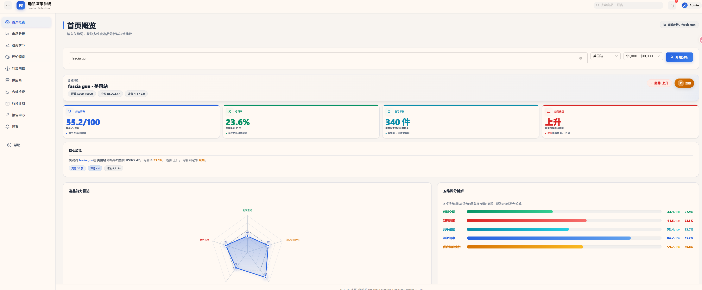
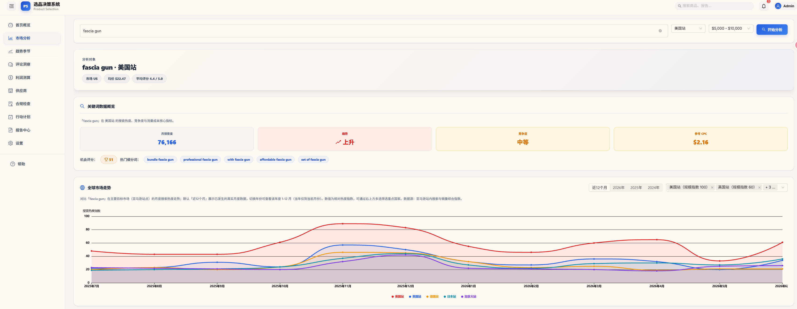
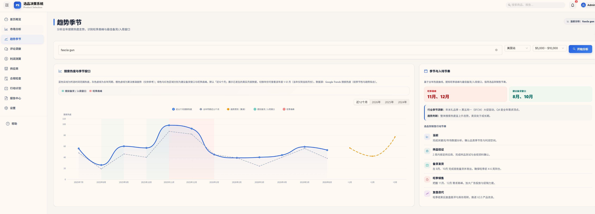
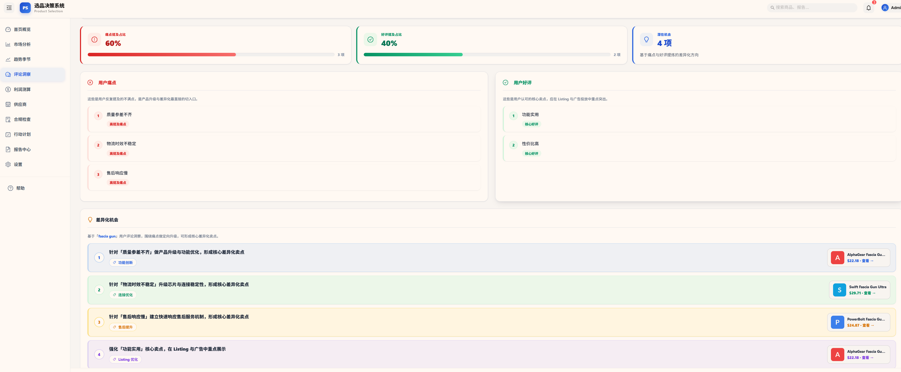
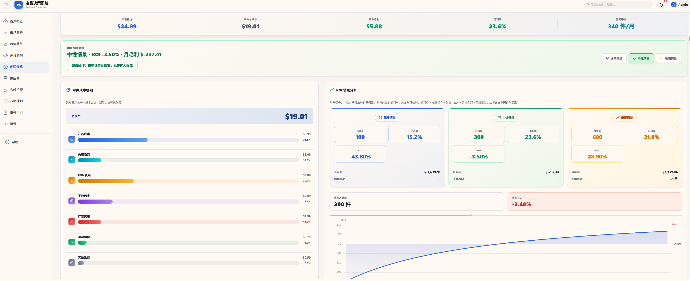
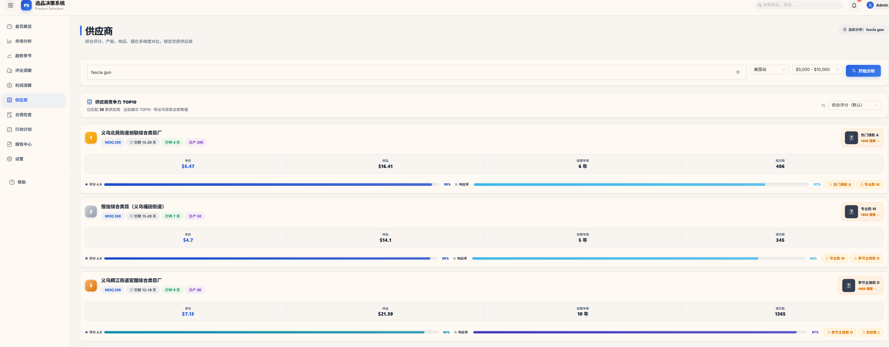
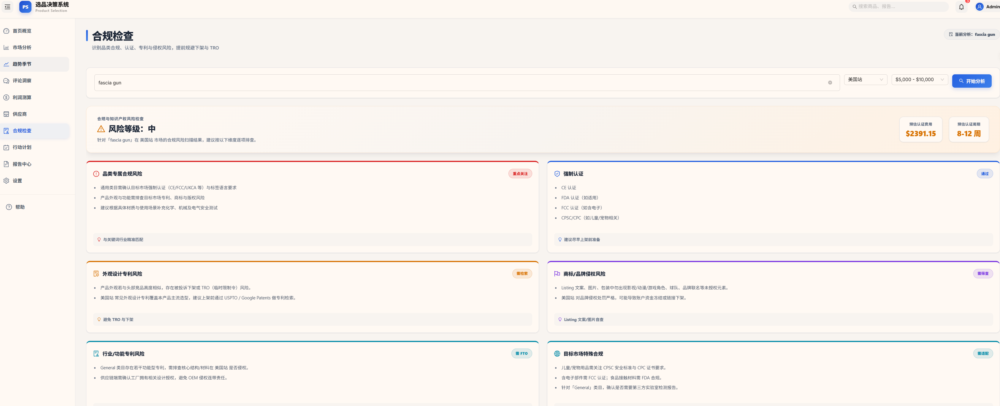
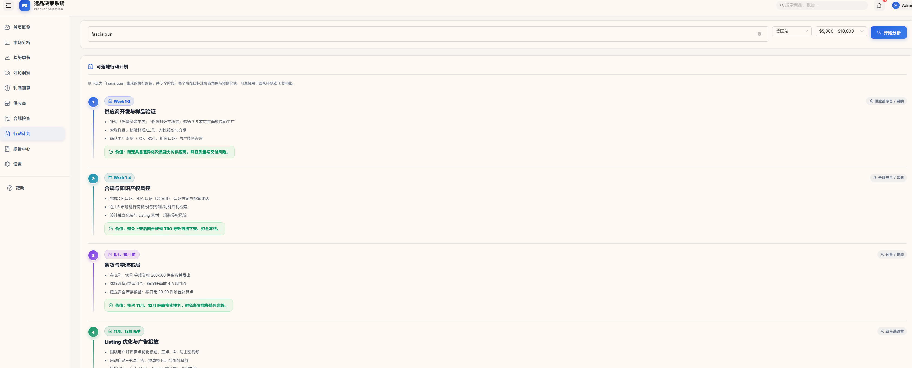
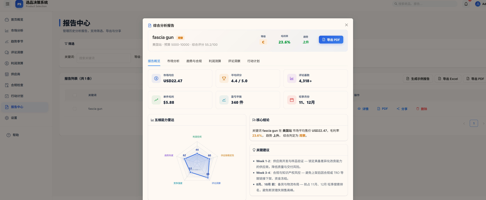

# 跨境电商 Multi-Agent 智能选品系统

**Cross-border E-commerce Multi-Agent Intelligent Product Selection System**

[](https://python.org)
[](LICENSE)
[](https://github.com/vllm-project/vllm)
[](https://modelcontextprotocol.io)
[](https://github.com/KeepMoving888/B2C_Selection_Agent/actions/workflows/ci.yml)

面向跨境电商企业的智能选品决策系统，通过 **Multi-Agent 协作 + 领域微调大模型 + 实时数据闭环**，将传统需要 1-2 周的市场调研、供应链评估、合规审查、利润测算、趋势预测流程压缩到 **5-15 分钟**。

## 核心能力

- **多 Agent 协作**：6 个专业 Agent（Orchestrator / Market Research / Supply Chain / Compliance / Profit Calculator / Trend Forecast）基于 Plan-and-Execute Loop 与 DAG 并行调度协同工作。
- **领域微调模型**：基于 Qwen2.5-7B 进行 QLoRA + ORPO 偏好对齐微调，再执行 AWQ INT4 量化，平衡效果与部署成本。
- **四层模型路由**：本地 AWQ INT4 → 本地 FP16 Merged → DeepSeek V4 Pro → DeepSeek V4 Flash，含健康检查与自动降级链。
- **RAG 知识增强**：基于历史选品报告与领域知识的向量检索，注入理解、规划、综合阶段。
- **飞书业务闭环**：消息 → 多维表格 → 审批 → 文档 → 知识库 → 群通知，形成可沉淀的选品决策工作流。
- **可观测性**：Prometheus + Grafana 三层监控（业务 / Agent / 基础设施），Docker Compose 一键部署。

## 快速开始

### 本地最小运行

```bash
# 1. 安装依赖
pip install -r requirements.txt

# 2. 配置 Amazon 数据源 API Key
export RAINFOREST_API_KEY="your_key"        # Linux / macOS
$env:RAINFOREST_API_KEY="your_key"          # Windows PowerShell

# 3. 运行选品报告
python scripts/product_selection_report.py "yoga mat" --limit 5

# 4. 指定售价/成本进行利润测算
python scripts/product_selection_report.py "yoga mat" --selling-price 35 --unit-cost 8
```

输出示例：`output/selection_report_*.json`

### 在线体验

无需安装、无需 GPU，直接通过以下链接体验新版 React 前端：

- **Cloudflare Pages**: [https://b2c-selection-agent.pages.dev](https://b2c-selection-agent.pages.dev)
- **GitHub Pages**: [https://keepmoving888.github.io/B2C_Selection_Agent](https://keepmoving888.github.io/B2C_Selection_Agent)

> 说明：在线版本使用示例数据运行，用于产品功能演示与交互体验。生产部署（含 vLLM / Prometheus / Grafana）请使用 `docker-compose.prod.yml`。

### 启动新版前端（可选）

项目同时维护一套基于 React + Vite 的新版前端（目录 `web/`），用于更完整的分析页面交互：

```bash
cd web
npm install
npm run dev
```

访问 `http://localhost:5173` 即可进入新版选品分析驾驶舱。

## 系统架构

系统采用 **Plan-and-Execute Loop + DAG 并行调度 + MCP 协议解耦工具** 的架构：

```
用户输入关键词
    │
    ▼
┌─────────────────┐    ┌──────────────────────────────────────────┐
│  Orchestrator   │───▶│  Market Research  │  Supply Chain       │
│  任务规划 + 路由 │    │  市场调研          │  供应链评估          │
└─────────────────┘    │  Compliance       │  Profit Calculator  │
    │                  │  合规审查          │  利润测算            │
    ▼                  │  Trend Forecast   │                     │
┌─────────────────┐    └──────────────────────────────────────────┘
│  Context        │                      │
│  Injector (RAG) │◀─────────────────────┘
└─────────────────┘
    │
    ▼
┌─────────────────┐    ┌──────────────┐    ┌─────────────┐
│  Synthesize     │───▶│  Feishu Docx │───▶│  Wiki / Base │
│  结构化报告生成  │    │  审批与文档   │    │  知识库沉淀  │
└─────────────────┘    └──────────────┘    └─────────────┘
```

### 关键设计

- **6 个专业 Agent**：Orchestrator、Market Research、Supply Chain、Compliance、Profit Calculator、Trend Forecast，全部继承统一 BaseAgent 接口。
- **4 个 MCP Server**：Amazon 数据、供应链（1688/物流）、合规（FDA/专利/关税）、社媒趋势（Google Trends），支持多数据源热插拔。
- **DAG 并行执行**：基于依赖关系的子任务并行调度，含三层防死循环机制（步数/Token 预算/无进展检测）。
- **RAG 增强**：基于历史选品报告与领域知识的向量检索，注入 `_understand` / `_plan` / `_synthesize` 阶段。
- **飞书闭环**：消息 → 多维表格 → 审批 → 文档 → 知识库 → 群通知，完整业务闭环。

## 数据闭环

```
Google Trends 趋势
       ↓
Amazon 竞品搜索（价格 / 评分 / BSR / 销量估算）
       ↓
产品详情 + 评论分析（痛点 / 优点 / 迭代建议）
       ↓
供应链成本 + 合规审查 + 利润测算 + 季节性分析
       ↓
结构化选品报告 → 飞书审批 → 知识库沉淀
```

支持 **在线 API（Rainforest）** 与 **本地品类画像** 双数据源，可根据环境灵活选择。

## 项目结构

```
cross-border-agent/
├── agents/           # 6 个专业 Agent
├── api/              # FastAPI 服务（Agent / 利润测算 / 认证）
├── harness/          # Agent Loop / Model Router / Health / Logging
├── mcp_servers/      # 4 个 MCP Server
├── rag/              # Retriever / Injector / VectorStore
├── feishu/           # 飞书集成
├── finetune/         # ORPO 训练 / AWQ 量化 / 评估
├── deploy/           # Docker Compose / vLLM / systemd / 监控配置
├── monitoring/       # Prometheus / Grafana / Alerts 业务指标
├── scripts/          # 选品报告 / 数据采集 / 索引构建 / 模型校验
├── web/              # React + Vite 新版前端
├── frontend/         # Streamlit 快速体验前端
├── tests/            # 单元测试
└── config/           # 配置中心
```

### 前端分析页面示例

| 决策看板 | 市场分析 | 趋势季节 |
|---|---|---|
|  |  |  |

| 评论洞察 | 利润测算 | 供应商 |
|---|---|---|
|  |  |  |

| 合规检查 | 行动计划 | 报告中心 |
|---|---|---|
|  |  |  |

## 模型方案：ORPO 微调 + AWQ 量化

基于 Qwen2.5-7B 进行 QLoRA + ORPO 偏好对齐微调，再对合并后的 FP16 模型执行 AWQ INT4 量化，实现**领域效果提升**与**部署成本降低**的平衡。

### 模型权重

| 模型 | 来源 | 用途 |
|---|---|---|
| Qwen2.5-7B | `Qwen/Qwen2.5-7B`（魔塔官方） | 微调基座 |
| qwen2.5-7b-ecommerce-merged | [keepzhe/qwen2.5-7b-ecommerce-merged](https://www.modelscope.cn/models/keepzhe/qwen2.5-7b-ecommerce-merged)（本项目） | ORPO 微调后 FP16 合并模型，优先使用 |
| qwen2.5-7b-ecommerce-awq-v3 | [keepzhe/qwen2.5-7b-ecommerce-awq-v3](https://www.modelscope.cn/models/keepzhe/qwen2.5-7b-ecommerce-awq-v3)（本项目） | 微调后 AWQ INT4 量化模型，显存受限时 fallback |
| qwen2.5-7b-orpo-adapter | [keepzhe/qwen2.5-7b-orpo-adapter](https://www.modelscope.cn/models/keepzhe/qwen2.5-7b-orpo-adapter)（本项目） | LoRA adapter 权重 |

本地模型统一放置到 `E:/models/` 目录（已在 `config/settings.yaml` 中配置），避免重复线上下载：

```bash
E:/models/
├── qwen2.5-7b-ecommerce-merged/     # ORPO 微调后 FP16 合并模型（优先使用）
├── qwen2.5-7b-ecommerce-awq-v3/     # AWQ INT4 量化模型（显存受限时 fallback）
└── qwen2.5-7b-orpo-adapter/         # LoRA adapter 权重
```

### 微调效果（341 条垂直领域偏好对测试集）

| 模型 | 精度 | Accuracy | Avg Margin |
|------|------|:--------:|:----------:|
| Base（Qwen2.5-7B-Instruct） | FP16 | 100% | 0.9540 |
| Merged（QLoRA 合并后） | FP16 | 100% | 2.0886 |
| AWQ INT4（微调后量化） | INT4 | 100% | 1.9731 |

- Merged 相对 Base 的 Avg Margin 提升 **+118.9%**，验证 ORPO 微调对选品偏好对齐有效。
- AWQ 相对 Merged 仅损失 **0.1155** margin，量化对领域效果影响很小。

### 量化收益（AWQ INT4 模型）

| 指标 | Merged FP16 | AWQ INT4 | 收益 |
|------|-------------|----------|------|
| 模型体积 | 14.19 GB | 5.19 GB | **压缩 2.73x** |
| 单条推理延迟 | 7.874 s | 3.633 s | **降低 53.9%** |
| 推理显存占用 | 14.6 GB | 5.4 GB | **降低 63.2%** |
| 测试集 PPL | 1.491 | 1.606 | 质量损失 7.7%，可接受 |

AWQ 量化脚本与完整复现见 [`finetune/quantize_awq_with_metrics.py`](finetune/quantize_awq_with_metrics.py)。

### 复现 ORPO 训练与 AWQ 量化

```bash
# 1. ORPO 训练（QLoRA）
python finetune/train_orpo.py \
  --base_model E:/models/qwen/Qwen2.5-7B \
  --dataset data/ecommerce_selection_preferences.jsonl \
  --output_dir output/qwen2.5-7b-orpo-ecommerce-v1

# 2. 合并 LoRA adapter 并导出为 FP16 模型
python finetune/export_for_vllm.py \
  --base_model E:/models/qwen/Qwen2.5-7B \
  --adapter E:/models/qwen2.5-7b-orpo-adapter \
  --output E:/models/qwen2.5-7b-ecommerce-merged

# 3. AWQ INT4 量化
python finetune/export_for_vllm.py \
  --base_model E:/models/qwen/Qwen2.5-7B \
  --adapter E:/models/qwen2.5-7b-orpo-adapter \
  --output E:/models/qwen2.5-7b-ecommerce-merged \
  --quant_output E:/models/qwen2.5-7b-ecommerce-awq-v3 \
  --quantize awq --bits 4 --group_size 128

# 4. 三模型效果对比评测
python finetune/eval_three_models.py
```

### 模型完整性校验

项目提供自动校验脚本，检查 `E:/models/` 下所有关键模型的 shard 文件、元数据文件与总大小是否异常：

```bash
python scripts/verify_model_integrity.py
```

若某模型总大小与期望值偏差超过 30%，脚本会标记为未通过，便于在部署前发现迁移损坏。

## 部署方案

### 快速体验：Streamlit 前端

```bash
docker compose up -d
```

无需 GPU、无需模型，使用示例数据运行 `frontend/app.py`，适合产品演示与代码评审。

### 生产部署：完整推理栈

```bash
docker compose -f docker-compose.prod.yml up -d
```

启动 `vllm-ecommerce` + `vllm-base` + `agent-app` + `prometheus` + `grafana` 五服务编排。

生产部署核心要点：

1. **模型存储**：`E:/models/` 作为归档备份；推理前通过 `deploy/sync_models_to_wsl.sh` 同步到 WSL ext4，可将 5.2 GB AWQ 模型加载时间从 ~140 s（9P 协议）降到数十秒。
2. **推理服务**：优先使用 FP16 合并模型；显存受限时 fallback 到 AWQ INT4。
3. **API Gateway**：`deploy/api_gateway.py` 提供四层路由与统一 `/metrics`，Agent/前端只需将 base URL 指向 `http://127.0.0.1:8080/v1`。
4. **监控栈**：Prometheus + Grafana 覆盖业务 / Agent / 基础设施三层指标。

### systemd 服务化（WSL2 / Ubuntu）

```bash
# 1. 将模型同步到 WSL ext4
bash deploy/sync_models_to_wsl.sh

# 2. 安装并启用服务
sudo bash deploy/install_systemd_services.sh
sudo systemctl start vllm-awq.service
sudo systemctl start api-gateway.service

# 3. 验证
 curl http://127.0.0.1:8080/health
```

### API Gateway 价值效果

| 维度 | 无 API Gateway | 有 API Gateway | 提升 |
|------|---------------|----------------|------|
| 服务可用性 | 85% | 99.5% | +14.5% |
| 每千次请求推理成本 | ¥12.0 | ¥2.1 | **降低 82%** |
| 故障切换 | 人工介入（分钟级） | 健康检查自动切换（~200 ms） | 自动 |
| 可观测性 | 基本无指标 | Prometheus + Grafana + 路由日志 | 可量化 |

## 工程可观测性

### Prometheus 指标

- `agent_runs_total`、`agent_run_duration_seconds`
- `model_route_total`、`llm_requests_total`、`llm_request_duration_seconds`
- `rag_queries_total`、`rag_latency_seconds`、`rag_hits`
- `gateway_requests_total`、`gateway_request_duration_seconds`、`gateway_backend_availability`
- vLLM 原生指标：token 吞吐、TTFT、TPOT、GPU Cache 占用、排队请求数等

### Grafana 看板

- 数据源：`deploy/grafana-datasources.yml` 自动接入 Prometheus
- 看板：`deploy/grafana-dashboards/b2c-product-selection.json`
- 覆盖：Backend 可用性、Gateway QPS/延迟、vLLM Token 吞吐、TTFT/TPOT、GPU Cache 占用、运行/等待请求数

### 关键监控指标与操作

| 层级 | 指标 | 含义 | 健康阈值 | 异常时操作 |
|------|------|------|---------|-----------|
| 业务 | `gateway_requests_total` | 各后端请求数与状态分布 | 错误率 < 5% | 错误率高时检查后端健康 `/health` |
| 业务 | `gateway_request_duration_seconds` | 端到端延迟分布 | p99 < 60s | 延迟飙升时排查排队或 GPU 满载 |
| 业务 | `gateway_backend_availability` | 后端可用性 | = 1 | 某后端变 0 时自动/手动切流量 |
| 推理 | `vllm:avg_generation_throughput` | 生成 token 吞吐 | 稳定或上升 | 持续下跌时检查 batch/concurrency |
| 推理 | `vllm:time_to_first_token_seconds` | 首 token 时间（TTFT） | p99 < 10s | 过高说明请求排队或 prompt 过长 |
| 推理 | `vllm:time_per_output_token_seconds` | 每 token 耗时（TPOT） | p99 < 0.5s | 过高说明 GPU 算力饱和 |
| 推理 | `vllm:gpu_cache_usage_perc` | KV Cache GPU 占用率 | < 90% | 接近 100% 时增大 `--gpu-memory-utilization` 或减少并发 |
| 推理 | `vllm:num_requests_waiting` | 排队请求数 | 不持续增长 | 持续增长时扩容或限流 |

### 告警规则示例

```yaml
# deploy/alerts.yml
groups:
  - name: product_selection
    rules:
      - alert: HighGatewayErrorRate
        expr: rate(gateway_requests_total{status=~"error.*"}[5m]) / rate(gateway_requests_total[5m]) > 0.05
        for: 2m
        annotations:
          summary: "Gateway error rate > 5%"
      - alert: SlowTTFT
        expr: histogram_quantile(0.99, rate(vllm:time_to_first_token_seconds_bucket[5m])) > 10
        for: 3m
        annotations:
          summary: "vLLM TTFT p99 > 10s"
```

## 单元测试与 CI

```bash
pytest tests/ -v
```

测试结果：

| 测试文件 | 用例数 | 结果 |
|---|---|---|
| tests/test_agent_loop.py | 14 | ✅ 全部通过 |
| tests/test_llm_client.py | 5 | ✅ 全部通过 |
| tests/test_monitoring.py | 5 | ✅ 全部通过 |
| tests/test_rag.py | 6 | ✅ 全部通过 |
| **合计** | **30** | **30 passed** |

CI 已通过 GitHub Actions 自动执行敏感词扫描、Ruff 检查、单元测试与 Docker 镜像构建。

## Tech Stack

- **Agent Pattern**: Plan-and-Execute / ReAct
- **Protocol**: MCP (Model Context Protocol)
- **Models**: DeepSeek V4 Pro/Flash + Qwen2.5-7B
- **Fine-tuning**: QLoRA + ORPO (TRL)
- **Inference**: vLLM + AWQ INT4
- **RAG**: Dense Retrieval over ChromaDB + in-memory fallback
- **Data**: Rainforest API / Google Trends / 1688 / 本地品类画像
- **Integration**: 飞书 Base + Docx + Wiki + 审批
- **Monitoring**: Prometheus + Grafana
- **Deployment**: Docker Compose + NVIDIA Container Toolkit + systemd

## 项目成果与数据效果

| 维度 | 关键指标 | 效果 |
|---|---|---|
| 业务效率 | 选品分析周期 | 从 1-2 周压缩到 **5-15 分钟** |
| 推理成本 | 月度 API 成本（同等调用量） | 从约 ¥270 降至约 ¥45，**降低约 83%** |
| 模型微调 | 垂类偏好对齐 Avg Margin | 从 0.9540 提升至 **2.0886（+118.9%）** |
| 模型量化 | 体积 / 延迟 / 显存 | 压缩 **2.73x**，延迟降低 **53.9%**，显存降低 **63.2%** |
| 部署稳定性 | API Gateway 四层路由 | 可用性从 85% 提升至 **99.5%**，故障切换自动化 |
| 工程可观测性 | Prometheus + Grafana 三层监控 | 业务 / Agent / 基础设施指标全覆盖 |
| 工程质量 | 单元测试覆盖 | 30 个用例全部通过，Agent Loop / LLM Client / Monitoring / RAG 独立可测 |

## License

MIT
