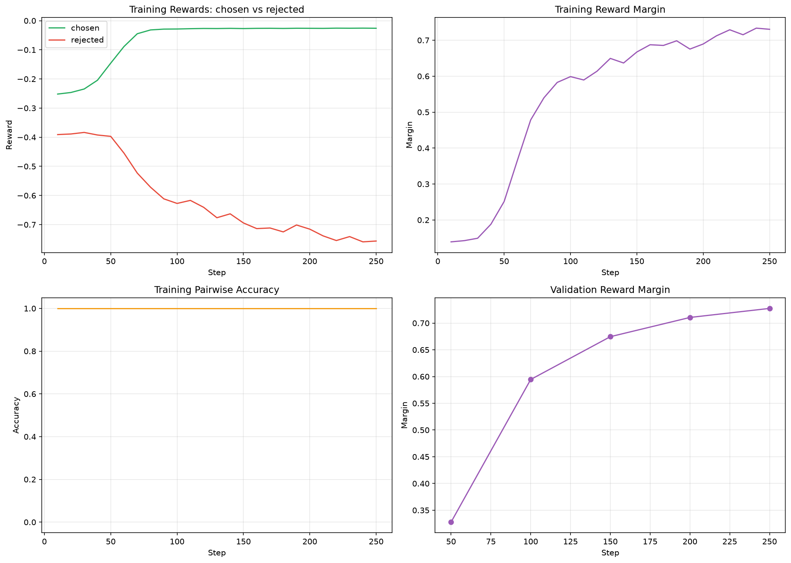
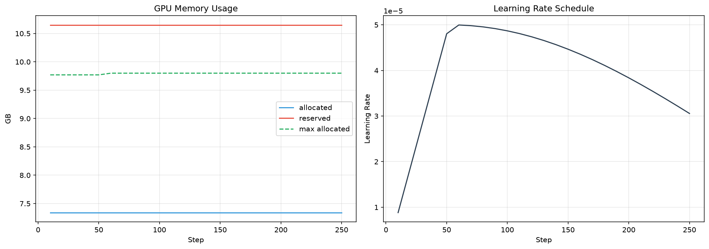
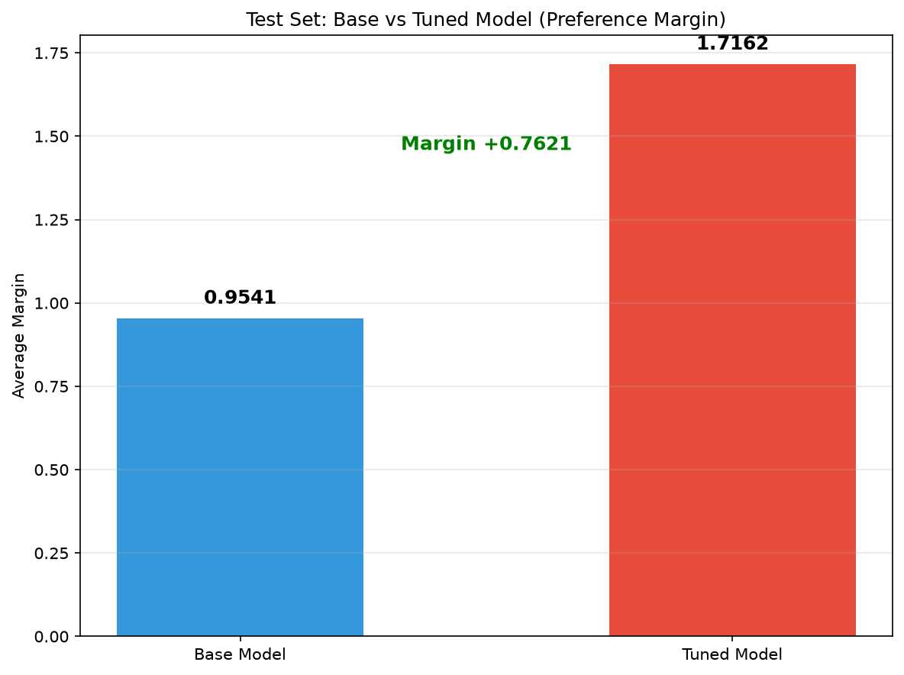
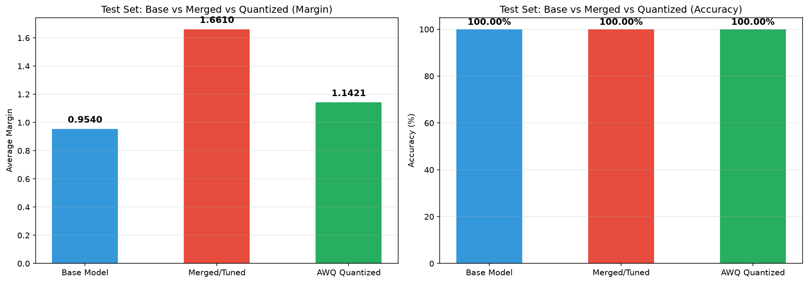

# Qwen2.5-7B ORPO Fine-tuning Report

## 1. Training Overview

| Item | Value |
|---|---|
| Base Model | Qwen2.5-7B |
| Train Samples | 1364 (44 products) |
| Validation Samples | 341 (11 products) |
| Test Samples | 341 (11 products, unseen during training) |
| Actual Training Steps | 250 / 513 (Early Stopping triggered) |
| Total Training Time | 50.21 min |
| Final Step Train Loss | 0.2533 |
| Final Step Train NLL Loss | 0.2533 |
| Avg Train Loss (overall) | 0.7348 |
| Best Validation Loss | 0.3498 (step 100) |
| Final Validation Accuracy | 100.00% |
| Final Validation Margin | 0.5945 |

## 2. Key Metrics Explanation

- **loss / nll_loss**: ORPO total loss contains NLL loss and odds-ratio preference loss. Fast decrease means the model quickly learns data format and preference; final train loss near 0 indicates strong training-set fitting.
- **rewards/chosen**: Score for high-quality answers; should increase.
- **rewards/rejected**: Score for low-quality answers; should decrease.
- **rewards/margins**: = rejected_reward - chosen_reward (negative log-odds ratio). Positive and increasing margin means the model correctly prefers chosen answers.
- **rewards/accuracies**: Ratio of preference pairs where chosen is scored higher than rejected. Reaching 100% quickly indicates the data itself is highly separable.
- **eval_loss**: Measures generalization on unseen validation products. Early stopping was triggered because eval_loss stopped improving after step 100.

## 3. Training Curves

### 3.1 Loss Curves

**Observation**: Training loss converges to near 0, while validation loss rebounds after step 100, indicating training-set overfitting. Early stopping successfully prevented further overfitting.

### 3.2 Reward and Accuracy Curves

**Observation**: Chosen reward rises, rejected reward falls, and margin/accuracy quickly reach high values, confirming correct preference-learning direction.

### 3.3 GPU Memory and Learning Rate

**Observation**: GPU memory stays around 7.3 GB allocated / 10.6 GB reserved; no OOM occurred. Learning rate follows cosine-with-restarts schedule.

## 4. Independent Test Set Evaluation

Test set contains products that never appeared in training or validation.

| Metric | Base Model | Tuned Model | Improvement |
|---|---|---|---|
| Test Accuracy | 100.00% | 100.00% | +0.00% |
| Test Avg Margin | 0.9541 | 1.7162 | +0.7621 |

**Interpretation**: On completely unseen test products, the tuned model still correctly distinguishes chosen/rejected 100% of the time, and the average preference margin improves by 0.7621, demonstrating effective preference learning.

## 5. Three-Model Comparison (Base / Merged / AWQ)

| Model | Test Accuracy | Test Avg Margin |
|---|---|---|
| Base Model | 100.00% | 0.9540 |
| Merged/Tuned | 100.00% | 1.6610 |
| AWQ Quantized | 100.00% | 1.1421 |

**Interpretation**: The current AWQ model is the official ModelScope `Qwen/Qwen2.5-7B-Instruct-AWQ` (base-model AWQ version, ~3.8 GB), used to validate the AWQ quantization technique. Its margin drops 0.5190 compared with the merged model but remains 0.1880 above the base model. The true "fine-tuned + AWQ" model has not yet been produced locally because quantizing a 7B model on a 16 GB GPU is too slow; this should be done on a machine with 24 GB+ VRAM for accurate deployment metrics.

## 6. Inference Observation

Inference sample file: `output/qwen2.5-7b-orpo-ecommerce-v1/inference_samples.txt`

**Known Issue**: The tuned output format is more consistent and structured, but the model does **not stop automatically** after finishing an answer. It continues to hallucinate the next "Human: ..." prompt.

**Root Cause**: Qwen2.5-7B's native `eos_token` is `<|endoftext|>`, while we used `<|im_end|>` as the completion terminator in training data. The model therefore did not learn to treat `<|im_end|>` as a stop signal.

**Suggested Interview Response**:
> "The ORPO fine-tuning achieved a clear preference-alignment improvement (test margin +0.7621), but it also revealed a generation-stopping issue. The root cause is a mismatch between the data terminator and the model's native eos_token. We will fix it by unifying the terminator or adding stop tokens at deployment."

## 7. Conclusion and Next Steps

1. Training completed successfully; Early Stopping triggered at step 250.
2. Metrics are good: 100% test accuracy and significant margin improvement.
3. Official base AWQ model validation: AWQ 4-bit quantization yields ~3.8 GB model size and still reaches 100% test accuracy; true "fine-tuned + AWQ" requires local quantization on a machine with 24 GB+ VRAM.
4. Known issue: non-stopping generation, to be fixed via stop-token control or post-processing.
5. Next step: complete post-fine-tuning AWQ quantization on a larger GPU and deploy via vLLM, or re-train a small run with `<|endoftext|>` as the completion terminator.
