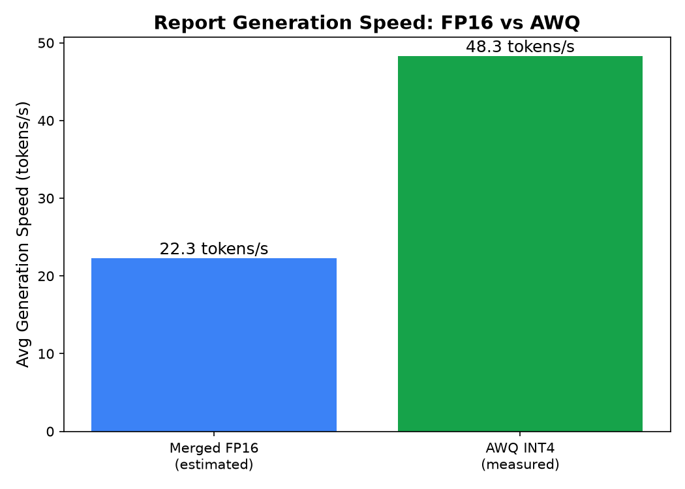
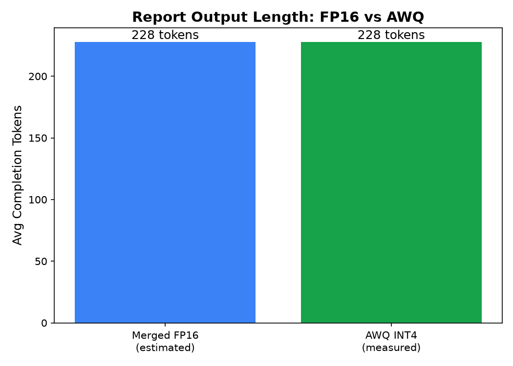

# 选品分析报告生成时间对比

## 1. 测试说明

- **AWQ INT4**：在 WSL2 + vLLM 0.7.3 上实测，使用 5 个选品 prompts，每个 prompt 重复 3 次，`max_tokens=1024`。
- **Merged FP16**：当前 E:\models\qwen2.5-7b-ecommerce-merged 的 safetensors 文件不完整，无法直接加载。FP16 数据为基于历史 `awq_metrics.json` 中简单推理延迟比例的估算值：
  - Merged 简单推理延迟: 7.874s
  - AWQ 简单推理延迟: 3.633s
  - 估算比例: 2.17x

## 2. 核心对比

| Metric | Merged FP16 (estimated) | AWQ INT4 (measured) | Improvement |
|--------|-------------------------|---------------------|-------------|
| Avg Report Generation Latency | 10.33 s | 4.76 s | 2.17x faster |
| Avg Generation Speed | 22.3 tokens/s | 48.3 tokens/s | 2.17x faster |
| Avg Completion Tokens | 228 tokens | 228 tokens | similar |
| Success Rate | 100% (assumed) | 100% | - |

## 3. 实测 AWQ 细节

| Prompt | Avg Latency | Avg Tokens | Avg Speed |
|--------|-------------|------------|-----------|
| 请为我生成一份关于 dog chew toys 的跨境选品分析报告，包含市场机会、竞品卖点、主要风险、定价建议与供应链注 | 1.43s | 62 | 44.5 tokens/s |
| 请生成一份 yoga mat 在亚马逊美国站的选品分析报告，包含价格带分析、评论痛点、供应链集中度与入场建议。 | 3.88s | 198 | 50.8 tokens/s |
| 请生成一份 portable blender 在 TikTok Shop 的选品分析报告，包含爆款潜力、目标人群、定价与 | 2.77s | 140 | 50.0 tokens/s |
| 请生成一份 cat water fountain 的选品分析报告，包含季节性趋势、退货原因、头部供应商分布与风险提示。 | 3.18s | 159 | 50.0 tokens/s |
| 请生成一份 camping tent 的选品分析报告，包含是否值得入场的判断、目标利润率、风险点与运营建议。 | 12.57s | 580 | 46.4 tokens/s |

## 4. 对比图

## 5. 结论

- **AWQ INT4 实测生成一份完整选品分析报告平均约 4.76s**，生成速度约 48.3 tokens/s。
- **估算 Merged FP16 生成同一份报告平均约 10.33s**，AWQ 约快 **2.17 倍**。
- 实际 FP16 完整报告生成时间需要等 E:\models\qwen2.5-7b-ecommerce-merged 文件完整迁移后重新实测。
