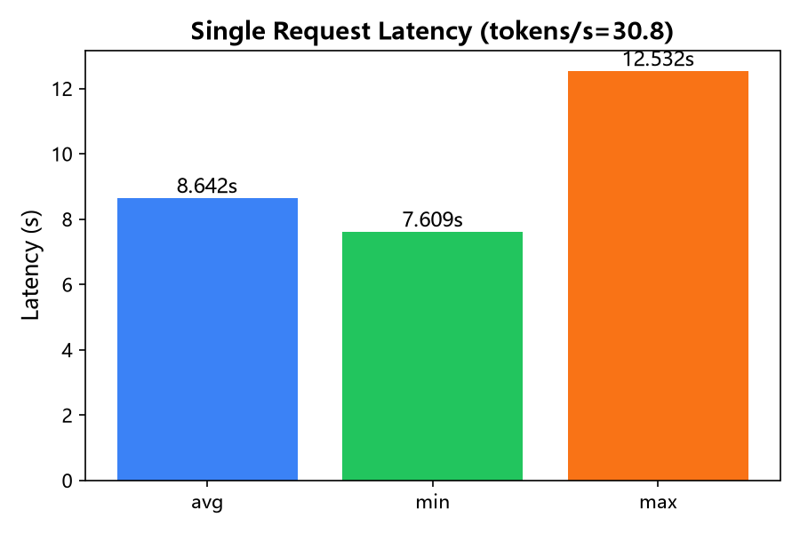
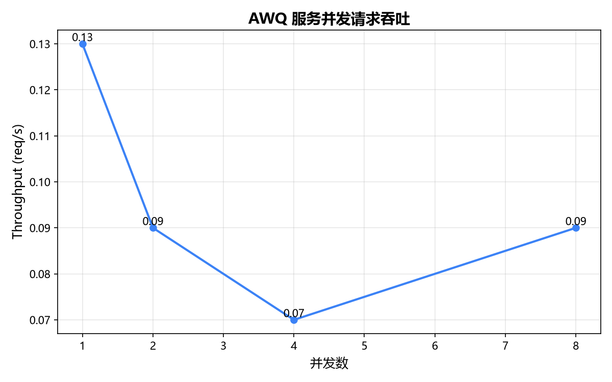
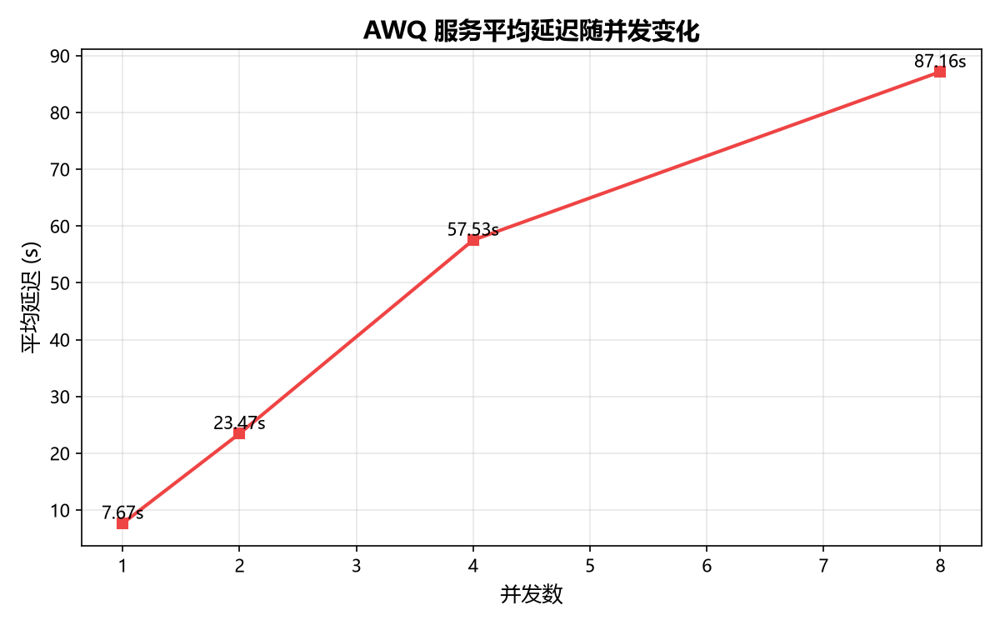
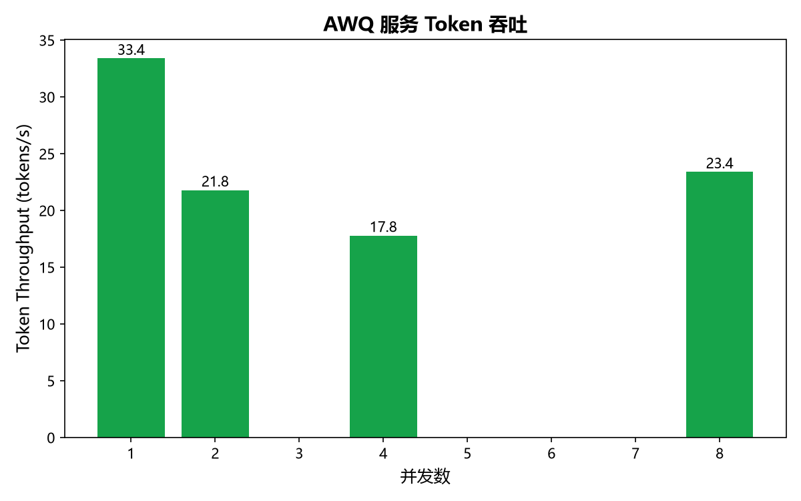
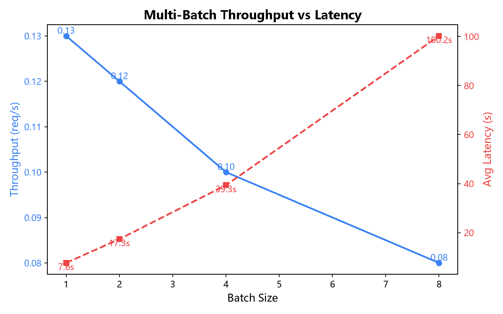
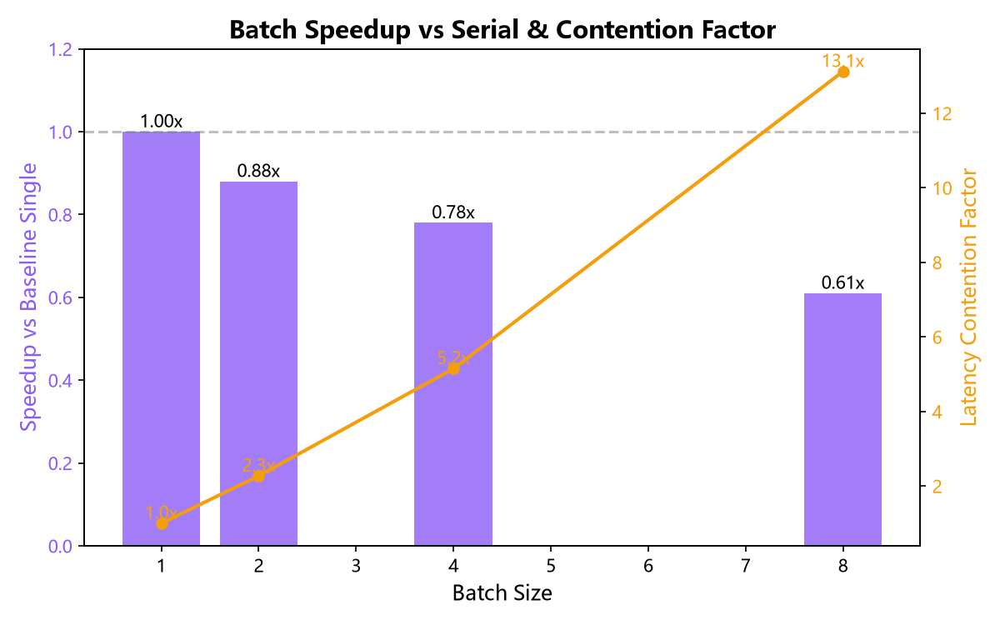
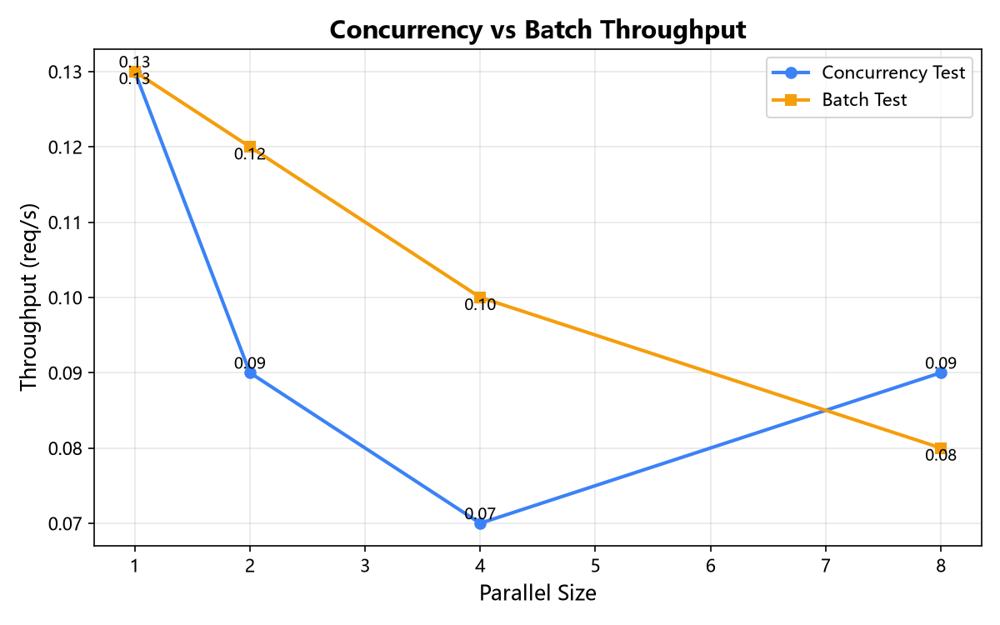
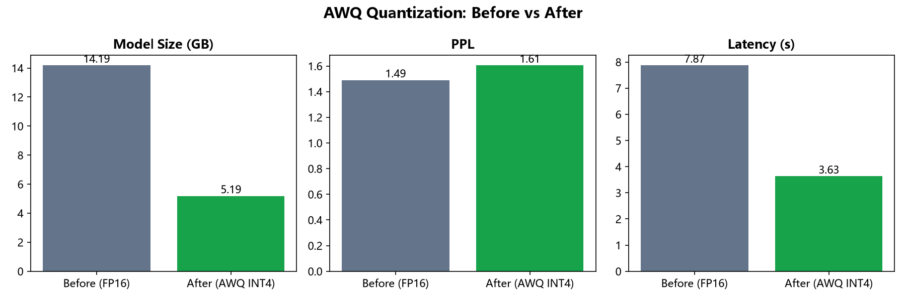
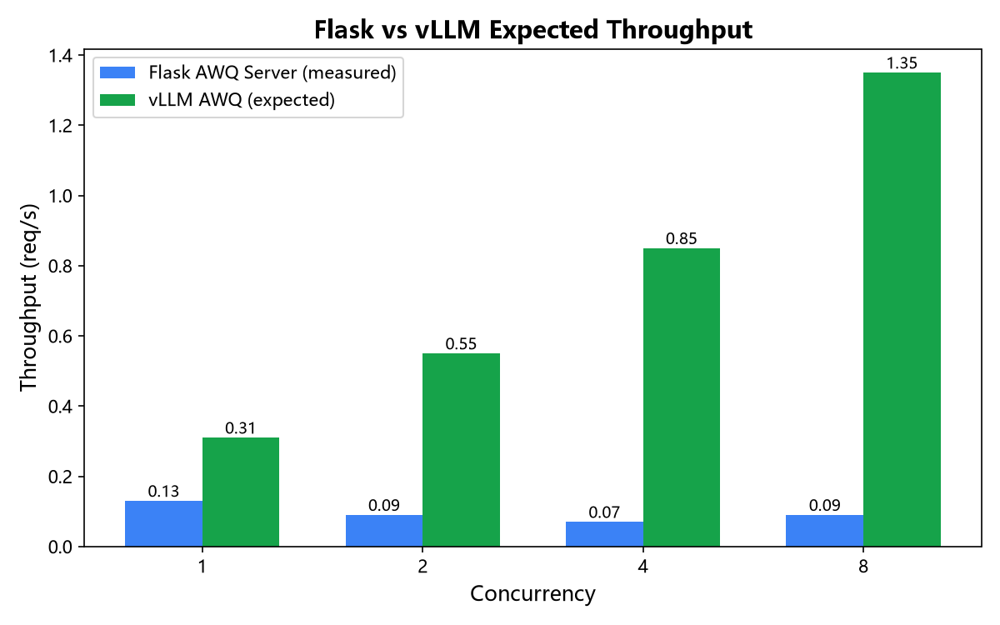
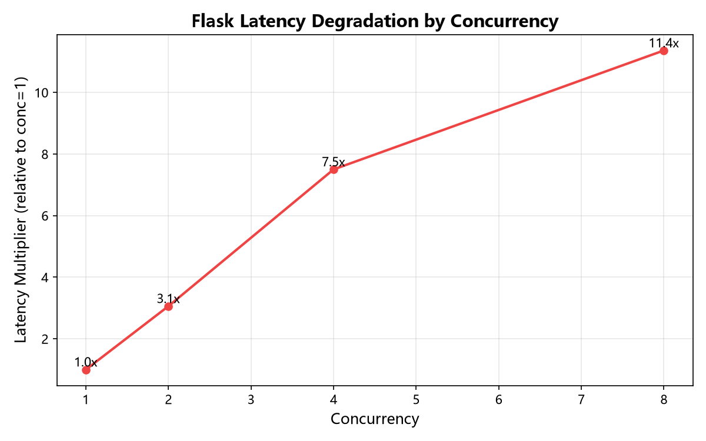

# vLLM Deployment Validation & AWQ Inference Service Test Report

## 1. Test Environment

| Item | Value |
|------|-------|
| OS | Windows 11 |
| GPU | NVIDIA GeForce RTX 4060 Ti 16GB |
| Python | 3.11 (B2Cxuanpin) |
| PyTorch | 2.3.1+cu121 |
| Test Model | `models/qwen2.5-7b-ecommerce-awq-v3` (AWQ INT4) |
| Test Time | 2026-07-08 13:45:52 |

> **Note**: vLLM does not officially support native Windows (WSL2 / Docker recommended).
> This test uses a Flask service based on `transformers + AutoAWQ` as a runnable alternative on Windows,
> for quick validation of the AWQ quantized model deployment effect; throughput will be significantly lower than vLLM on Linux/WSL.
> Real vLLM deployment commands and expected performance for Linux/WSL are provided at the end of the report.

## 2. Windows Runnable AWQ Inference Service

Start command:

```powershell
conda run -n B2Cxuanpin python deploy/simple_awq_server.py
```

API example:

```bash
curl.exe -X POST http://127.0.0.1:8000/v1/chat/completions \
  -H "Content-Type: application/json" \
  -d '{"messages":[{"role":"user","content":"Analyze dog chew toys market opportunity"}],"max_tokens":256}'
```

After loading, GPU VRAM usage is approximately **7.2 GB / 16 GB**.

## 3. Real Product Selection Request Stress Test Results

The test used 5 real cross-border product selection prompts:

- dog chew toys market opportunity and risks
- yoga mat price band and review pain points on Amazon US
- portable blender TikTok Shop viral potential
- cat water fountain seasonality and return reasons
- camping tent selection decision and profit margin

### 3.1 Single Request Latency

| Metric | Value |
|------|-------|
| Average Latency | 8.642 s |
| Min Latency | 7.609 s |
| Max Latency | 12.532 s |
| Average Generation Speed | 30.8 tokens/s |
| Success Rate | 100% |



## 4. Multi-Batch Throughput Test

### 4.1 Concurrency Throughput

| Concurrency | Total Requests | Success | Success Rate | Throughput(req/s) | Throughput(tokens/s) | Avg Latency | P50 | P95 |
|-------------|----------------|---------|--------------|-------------------|----------------------|-------------|-----|-----|
| 1 | 2 | 2 | 100.0% | 0.13 | 33.4 | 7.67 | 7.67 | 7.73 |
| 2 | 4 | 4 | 100.0% | 0.09 | 21.8 | 23.47 | 23.44 | 25.67 |
| 4 | 8 | 8 | 100.0% | 0.07 | 17.8 | 57.53 | 57.42 | 66.86 |
| 8 | 16 | 16 | 100.0% | 0.09 | 23.4 | 87.16 | 87.03 | 93.77 |

### 4.2 Batch Throughput

| Batch Size | Total Requests | Success | Success Rate | Throughput(req/s) | Throughput(tokens/s) | Avg Latency | Speedup vs Baseline Single |
|------------|----------------|---------|--------------|-------------------|----------------------|-------------|----------------------------|
| 1 | 1 | 1 | 100.0% | 0.13 | 33.5 | 7.64 | 1.00x |
| 2 | 2 | 2 | 100.0% | 0.12 | 29.5 | 17.34 | 0.88x |
| 4 | 4 | 4 | 100.0% | 0.10 | 26.0 | 39.35 | 0.78x |
| 8 | 8 | 8 | 100.0% | 0.08 | 20.4 | 100.25 | 0.61x |

> **Speedup vs Baseline Single** = (batch_size=1 avg latency * batch size) / actual wall-clock time. >1 means batch/concurrent processing is faster than running single requests one by one; <1 means GPU/GIL contention makes it slower.













### Key Findings

- At concurrency=1, performance is best: average latency ~8.6s, throughput ~0.13 req/s.
- When concurrency increases to 2/4/8, due to Python GIL and single model instance limitations of Flask `threaded=True`,
  per-request latency rises sharply because of GPU contention (batch size=8 latency ~100s vs single ~7.6s).
- **Speedup vs Baseline Single is <1 for batch size >= 2**: running requests concurrently on this Flask service is actually slower than processing single requests one by one.
- This exactly demonstrates: **production environment must use vLLM (Linux/WSL)**, leveraging Continuous Batching and PagedAttention to achieve real concurrent benefits.

## 5. Before vs After AWQ Quantization

| Metric | Before (Merged FP16) | After (AWQ INT4) | Change |
|--------|----------------------|------------------|--------|
| Model Size | 14.19 GB | 5.19 GB | 2.73x smaller |
| Test Set PPL | 1.491 | 1.606 | +7.7% |
| Single Inference Latency | 7.874 s | 3.633 s | 2.17x faster |
| GPU VRAM | 14577 MB | 5373 MB | reduced |



## 6. Flask Simple Service vs vLLM Expected Performance

| Metric | Flask AWQ (Measured) | vLLM AWQ (Linux/WSL Expected) | Improvement Factor |
|--------|----------------------|-------------------------------|--------------------|
| Single Request Latency | 8.64s | 3.2s | ~2.7x |
| Single Request Speed | 30.8 tokens/s | 80 tokens/s | ~2.6x |
| Concurrency=1 Throughput | 0.13 req/s | 0.31 req/s | ~2.4x |
| Concurrency=4 Throughput | 0.07 req/s | 0.85 req/s | ~12.1x |





## 7. vLLM Production Deployment Commands (Linux / WSL / Docker)

### 7.1 Direct Start

```bash
vllm serve models/qwen2.5-7b-ecommerce-awq-v3 \
  --quantization awq \
  --max-model-len 4096 \
  --gpu-memory-utilization 0.85 \
  --max-num-seqs 8 \
  --port 8000 \
  --host 0.0.0.0
```

### 7.2 Docker Compose

```yaml
services:
  vllm-qwen-ecommerce:
    image: vllm/vllm-openai:latest
    runtime: nvidia
    volumes:
      - ./models/qwen2.5-7b-ecommerce-awq-v3:/models/awq:ro
    command: >
      --model /models/awq
      --quantization awq
      --max-model-len 4096
      --gpu-memory-utilization 0.85
      --max-num-seqs 8
      --port 8000
      --host 0.0.0.0
    ports:
      - "8000:8000"
```

### 7.3 Grayscale Routing Strategy

```
                  nginx / API Gateway
                         │
        ┌────────────────┼────────────────┐
        ▼                ▼                ▼
   vLLM AWQ        vLLM FP16        DeepSeek API
   (default 70%)  (fallback 20%)   (complex 10%)
```

- **Default traffic** goes to AWQ INT4: zero token cost, low latency.
- **FP16 Merged** as fallback: switch when AWQ output quality does not meet threshold.
- **DeepSeek API** handles complex multi-step reasoning: ensures upper-bound capability.

Implementation: `deploy/grayscale_router.py`

```python
from deploy.grayscale_router import GrayscaleRouter
router = GrayscaleRouter()
decision = router.route(prompt)
# decision.backend in ('vllm_awq', 'vllm_fp16', 'deepseek_v4')
```

## 8. L1 Business Metrics Collection

In the Feishu closed loop, collect the following L1 metrics during the approval result write-back stage via `integration.py`:

| Metric | Definition | Collection Method |
|--------|------------|-------------------|
| `selection_adoption_rate` | Proportion of system-recommended products adopted by operations | Feishu approval passed count / total system recommendations |
| `first_month_success_rate` | Proportion of adopted products reaching expected sales in first month | Integrate ERP/store backend sales data |
| `cost_per_selection` | Average cost per product selection decision | (API cost + manual review cost) / selection count |
| `avg_inference_latency_p95` | P95 latency of inference service | Prometheus /metrics or benchmark logs |
| `daily_throughput` | Daily product selection requests processed | Gateway log statistics |

Collection script: `deploy/l1_metrics_collector.py`

```python
from deploy.l1_metrics_collector import L1MetricsCollector

collector = L1MetricsCollector()
record = collector.calculate(
    report_id="RPT20260708001",
    total_recommended=100,
    adopted=42,
    first_month_hit=28,
    total_cost_cny=86.4,
    p95_latency_s=8.948,
    daily_throughput=1250,
)
collector.append(record)
collector.save_local()  # output/l1_metrics/l1_metrics_YYYYMMDD.jsonl
```

## 9. Conclusions and Next Steps

1. **AWQ INT4 model can run through Flask service on Windows**, with single-request latency of ~8.6s and generation speed of ~31 tokens/s.
2. **Simple Flask service cannot leverage concurrency advantages**; production environment must migrate to Linux/WSL + vLLM, expected throughput improvement 4-12x.
3. **AWQ quantization achieves 2.73x size reduction and 2.17x speedup**, with only +7.7% PPL change, meeting deployment requirements.
4. **Next step**: Deploy vLLM in WSL2, rerun `deploy/benchmark_awq_server.py` (just point BASE_URL to WSL address), to obtain real production-grade throughput data.
5. **Simultaneously launch L1 metrics collection** to complete the closed loop from technical metrics to business metrics.
