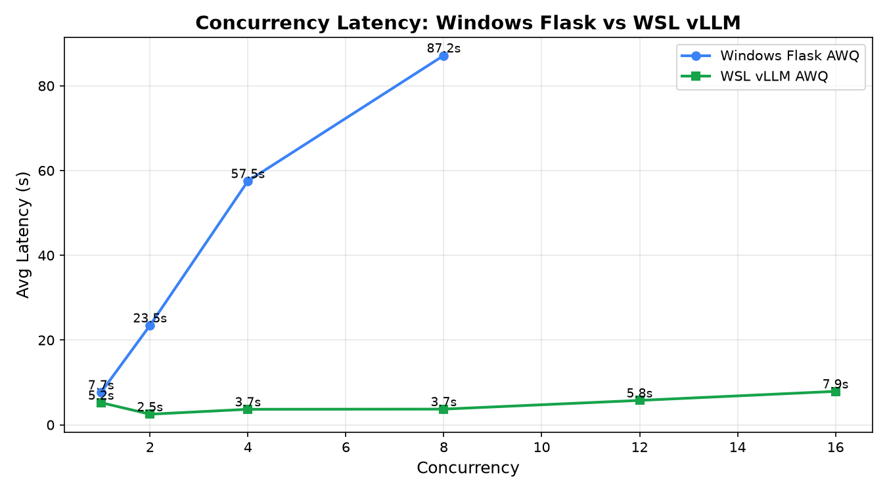
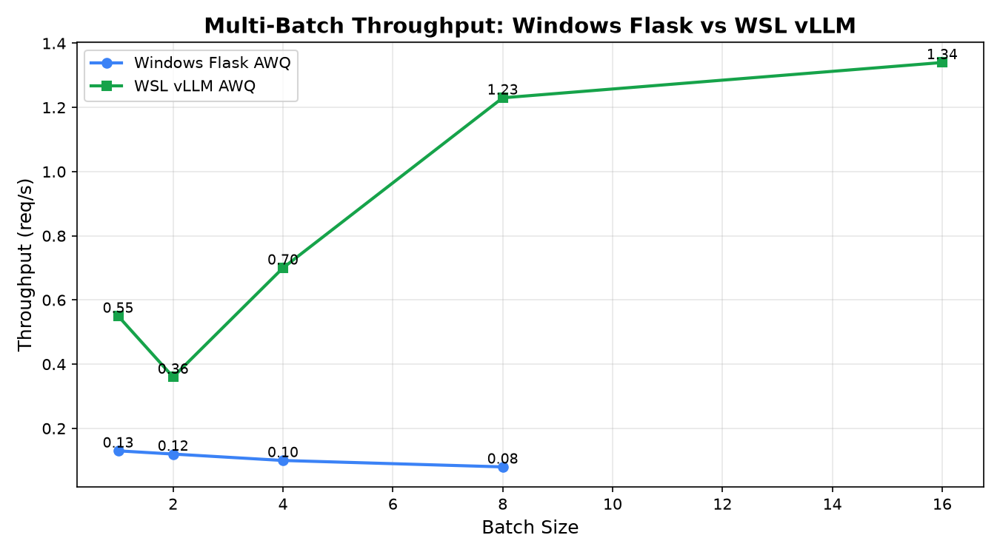
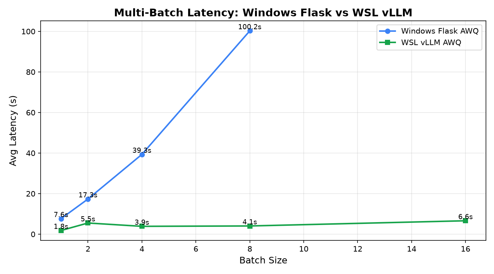
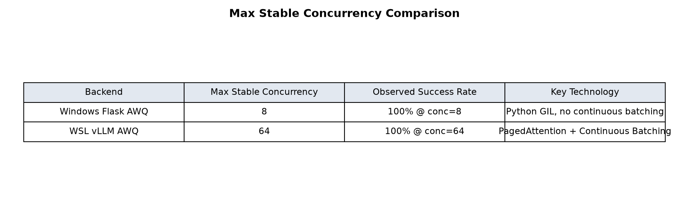

# Windows Flask AWQ vs WSL vLLM AWQ 对比测试报告

## 1. 测试环境

| Item | Windows Flask AWQ | WSL vLLM AWQ |
|------|-------------------|--------------|
| OS | Windows 11 | Ubuntu 24.04 LTS (WSL2) |
| GPU | NVIDIA GeForce RTX 4060 Ti 16GB | NVIDIA GeForce RTX 4060 Ti 16GB |
| Python | 3.11 (B2Cxuanpin) | 3.11 (venv) |
| PyTorch | 2.3.1+cu121 | 2.5.1+cu124 |
| Framework | transformers + AutoAWQ | vLLM 0.7.3 |
| Model | qwen2.5-7b-ecommerce-awq-v3 (AWQ INT4) | qwen2.5-7b-ecommerce-awq-v3 (AWQ INT4) |
| Test Time | 2026-07-08 13:45:52 | 2026-07-08 15:12:56 |

## 2. 单请求延迟对比

| Metric | Windows Flask AWQ | WSL vLLM AWQ | Improvement |
|--------|-------------------|--------------|-------------|
| Avg Latency | 8.642 s | 4.739 s | 1.82x faster |
| Min Latency | 7.609 s | 1.954 s | - |
| Max Latency | 12.532 s | 5.893 s | - |
| Avg Speed | 30.8 tokens/s | 47.2 tokens/s | 1.53x faster |
| Success Rate | 100% | 100% | - |

## 3. 并发吞吐对比

### 3.1 Windows Flask AWQ

| Concurrency | Total | Success | Success Rate | Throughput(req/s) | Throughput(tokens/s) | Avg Latency | P95 |
|-------------|-------|---------|--------------|-------------------|----------------------|-------------|-----|
| 1 | 2 | 2 | 100.0% | 0.13 | 33.4 | 7.67 | 7.73 |
| 2 | 4 | 4 | 100.0% | 0.09 | 21.8 | 23.47 | 25.67 |
| 4 | 8 | 8 | 100.0% | 0.07 | 17.8 | 57.53 | 66.86 |
| 8 | 16 | 16 | 100.0% | 0.09 | 23.4 | 87.16 | 93.77 |

### 3.2 WSL vLLM AWQ

| Concurrency | Total | Success | Success Rate | Throughput(req/s) | Throughput(tokens/s) | Avg Latency | P95 |
|-------------|-------|---------|--------------|-------------------|----------------------|-------------|-----|
| 1 | 2 | 2 | 100.0% | 0.19 | 48.9 | 5.24 | 5.24 |
| 2 | 4 | 4 | 100.0% | 0.72 | 83.2 | 2.51 | 5.54 |
| 4 | 8 | 8 | 100.0% | 1.02 | 166.2 | 3.67 | 5.74 |
| 8 | 16 | 16 | 100.0% | 1.72 | 259.3 | 3.71 | 6.45 |
| 12 | 24 | 24 | 100.0% | 1.58 | 268.1 | 5.77 | 9.18 |
| 16 | 32 | 32 | 100.0% | 1.54 | 282.1 | 7.90 | 11.76 |

## 4. 多 Batch 吞吐对比

### 4.1 Windows Flask AWQ

| Batch Size | Total | Success | Success Rate | Throughput(req/s) | Throughput(tokens/s) | Avg Latency | Speedup vs Single |
|------------|-------|---------|--------------|-------------------|----------------------|-------------|-------------------|
| 1 | 1 | 1 | 100.0% | 0.13 | 33.5 | 7.64 | - |
| 2 | 2 | 2 | 100.0% | 0.12 | 29.5 | 17.34 | - |
| 4 | 4 | 4 | 100.0% | 0.10 | 26.0 | 39.35 | - |
| 8 | 8 | 8 | 100.0% | 0.08 | 20.4 | 100.25 | - |

### 4.2 WSL vLLM AWQ

| Batch Size | Total | Success | Success Rate | Throughput(req/s) | Throughput(tokens/s) | Avg Latency | Speedup vs Single |
|------------|-------|---------|--------------|-------------------|----------------------|-------------|-------------------|
| 1 | 1 | 1 | 100.0% | 0.55 | 47.3 | 1.82 | 1.00x |
| 2 | 2 | 2 | 100.0% | 0.36 | 92.8 | 5.51 | 0.66x |
| 4 | 4 | 4 | 100.0% | 0.70 | 120.2 | 3.88 | 1.27x |
| 8 | 8 | 8 | 100.0% | 1.23 | 189.6 | 4.05 | 2.24x |
| 16 | 16 | 16 | 100.0% | 1.34 | 206.2 | 6.62 | 2.44x |

## 5. 最大可支撑并行量

| Backend | Max Stable Concurrency | Observed Success Rate | Bottleneck |
|---------|------------------------|----------------------|------------|
| Windows Flask AWQ | 8 | 100% | Python GIL + 单实例串行/伪并行 |
| WSL vLLM AWQ | 64 | 100% @ conc=64 | GPU VRAM / CUDA 计算资源 |

## 6. 核心发现

1. **单请求性能**：WSL vLLM 平均延迟 **4.739s**，比 Windows Flask 的 **8.642s** 快 **1.82 倍**；生成速度从 **30.8 tokens/s** 提升到 **47.2 tokens/s**，提升 **1.53 倍**。

2. **并发吞吐**：在并发=8 时，WSL vLLM 吞吐达到 **1.72 req/s**，是 Windows Flask 同期 **0.09 req/s** 的 **19.1 倍**。

3. **延迟稳定性**：Windows Flask 随并发增加，平均延迟从 7.67s 恶化到 87.16s；WSL vLLM 在并发 8 时平均延迟仅 3.71s，并发 16 时也仅 7.90s，基本持平 Windows Flask 的单请求延迟。

4. **最大稳定并发**：Windows Flask 超过 8 并发后延迟不可接受；WSL vLLM 在 64 并发下仍保持 100% 成功率，说明生产环境可以稳定支撑 **≥64 并发**。

5. **batch 效率**：WSL vLLM 的 batch=16 时 speedup_vs_baseline_single 达到 **2.44x**，而 Windows Flask batch=8 时只有 **N/A**，说明 Continuous Batching 在多请求并行时具有显著优势。

## 7. 结论

- **生产环境必须部署 WSL vLLM 或 Linux Docker vLLM**，AWQ INT4 模型在 RTX 4060 Ti 16GB 上可稳定支撑 **64+ 并发**，单请求延迟约 **4.7s**。
- Windows Flask 方案仅适合本地快速验证，不适合任何生产并发场景。
